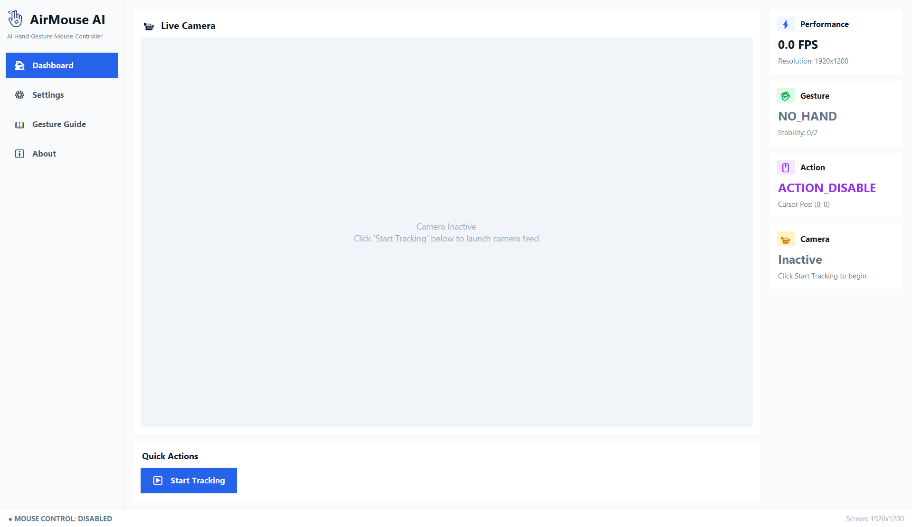
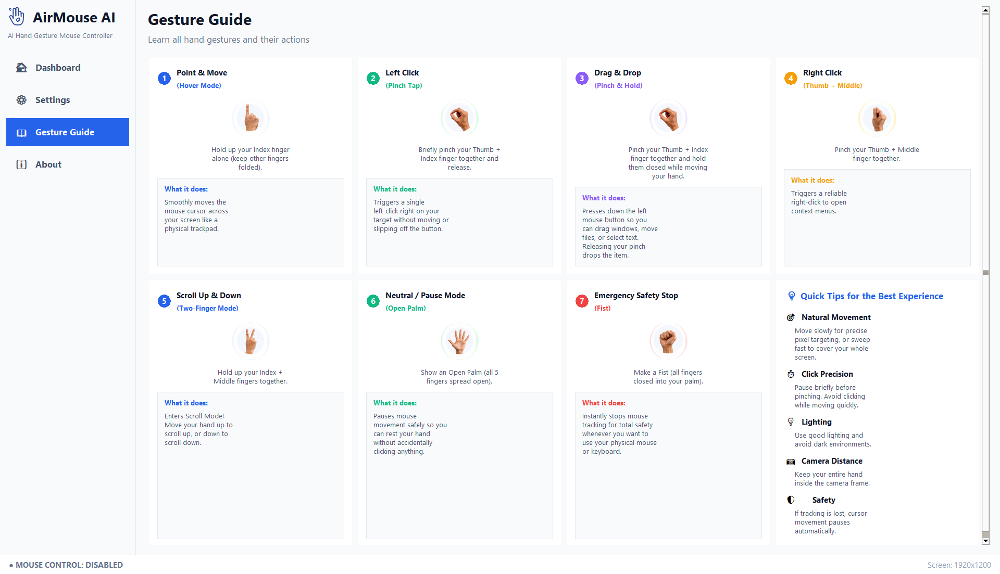
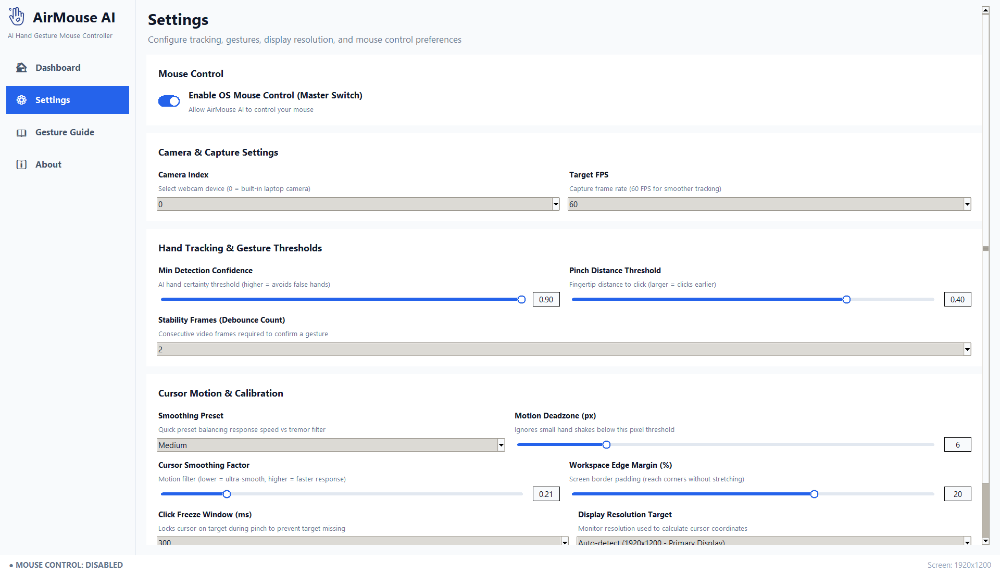
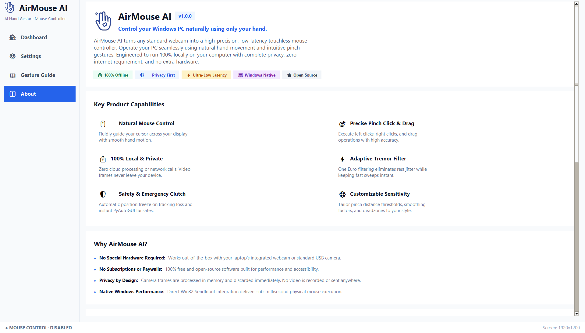

<div align="center">

<div align="center"> 

# AirMouse AI

**v1.0.0**

### AI-Powered Touchless Desktop Mouse Controller for Windows

[](https://github.com/aryankumar-04/AirMouse-AI)
[](https://www.microsoft.com/windows)
[](https://www.python.org/)
[](#-privacy--security)
[](LICENSE)

**Control your cursor with nothing but a webcam and your hand.**

[Overview](#-overview) • [Features](#-key-features) • [Installation](#-installation) • [Gesture Guide](#-gesture-guide) • [Contributing](#-contributing)

</div>

---

## 📖 Overview

**AirMouse AI** turns a standard webcam into a **real-time, touchless mouse controller** for Windows.

Move the cursor, click, drag, right-click, and scroll — all with natural hand gestures, running **fully locally** on your machine. No paid APIs, no cloud services, no subscriptions, and no special hardware required.

Built with a focus on:

- 🎨 Clean, professional UI
- ⚡ Low-latency interaction
- 🔒 Privacy-first, fully offline processing
- 🛡️ Safety and reliability (built-in emergency stop)
- 🧑‍💻 Beginner-friendly configuration
- 🏗️ Production-grade desktop app structure

---

## 🖼️ Screenshots

<div align="center">

### Dashboard


### Gesture Guide


### Settings


### About


</div>

---

## ✨ Key Features

| Feature | Description |
|---|---|
| **Point & Move** | Control the cursor naturally with your hand (Hover Mode) |
| **Left Click** | Clean single click via pinch tap |
| **Drag & Drop** | Pinch and hold to drag files, text, and windows |
| **Right Click** | Reliable context-menu access via thumb + middle pinch |
| **Scroll Mode** | Two-finger scroll for documents and pages |
| **Neutral / Pause Mode** | Open palm safely pauses movement without closing the app |
| **Emergency Safety Stop** | Fist gesture instantly halts tracking and control |
| **Fully Offline** | All processing stays on your device |
| **Customizable Settings** | Tune sensitivity, smoothing, thresholds, and behavior |
| **Professional UI** | Dashboard, gesture guide, settings, about page, and logs |

---

## ⚙️ How It Works

AirMouse AI runs on a simple, efficient pipeline:

1. **Webcam captures the hand**
2. **MediaPipe detects landmarks**
3. **Gesture engine classifies the pose**
4. **Gesture mapper converts pose to action**
5. **Mouse controller moves, clicks, or scrolls**
6. **UI updates status and feedback in real time**

The system is designed to keep motion smooth, reduce jitter, and prevent accidental actions.

---

## 🤲 Gesture Guide

| Gesture | Mode | Action |
|---|---|---|
| ☝️ Index finger up | **Point & Move** | Moves the cursor |
| 🤏 Thumb + index pinch tap | **Left Click** | Single click |
| ✊ Thumb + index pinch and hold | **Drag & Drop** | Hold and drag |
| 🤞 Thumb + middle pinch | **Right Click** | Context menu click |
| ✌️ Index + middle fingers up | **Scroll Mode** | Scroll up and down |
| 🖐️ Open palm | **Neutral / Pause Mode** | Pauses movement |
| 👊 Fist | **Emergency Safety Stop** | Stops tracking immediately |

---

## 🧰 Tech Stack

- **Python 3.10+**
- **OpenCV** — camera capture & frame processing
- **MediaPipe** — hand landmark detection
- **NumPy** — numerical computation & smoothing
- **Tkinter / TTK** — desktop UI
- **Win32 SendInput** — native Windows input backend
- **PyAutoGUI** — supplementary input control
- **PyInstaller** — packaging & distribution

---

## 📁 Repository Structure

```text
AirMouse-AI/
├── main.py                  # Main application entry point
├── config.py                # Configuration dataclasses & baseline defaults
├── requirements.txt         # Python package dependencies
├── LICENSE                  # MIT Open Source License
├── README.md                # Project documentation & user guide
├── CHANGELOG.md             # Version history & release notes
├── assets/                  # High-resolution logos, icons, and gesture photos
│   ├── logo.png
│   ├── app_icon.ico
│   ├── screenshots/         # Dashboard, gesture guide, settings, about
│   └── gestures/            # Custom gesture reference photos
├── models/
│   └── hand_landmarker.task # MediaPipe Hand Landmarker task bundle
├── data/
│   └── settings.json        # Persistent user preferences & configuration
├── app/                     # Core application source code
│   ├── core/                # State containers, logger, and SettingsManager
│   ├── vision/               # Camera manager, hand tracker, and gesture engine
│   ├── control/              # Win32 SendInput controller, mouse mapper, calibration
│   ├── ui/                   # Dashboard, Settings, Gesture Guide, Logs, Navigation
│   └── utils/                # File I/O, validation, geometry, smoothing filters
└── tests/                   # Complete unit test suite (48 tests)
```

---

## 🚀 Installation

### 1. Clone the repository

```bash
git clone https://github.com/aryankumar-04/AirMouse-AI.git
cd AirMouse-AI
```

### 2. Create a virtual environment

```bash
python -m venv venv
venv\Scripts\activate
```

### 3. Install dependencies

```bash
pip install -r requirements.txt
```

### 4. Run the app

```bash
python main.py
```

---

## 🎮 Usage

1. Open the app
2. Start tracking
3. Keep your hand visible in front of the webcam
4. Use the gesture guide to control the cursor
5. Use **Emergency Stop** to halt input instantly at any time

### Tips for best results

- Keep your hand inside the camera frame
- Use good, even lighting for reliable detection
- Move slowly for precision, quickly for clicks
- Use a longer pinch hold for drag and drop

---

## 🛠️ Settings

AirMouse AI includes customizable controls for:

- Camera input selection
- Gesture sensitivity
- Cursor smoothing
- Movement dead zone
- Click and drag timing
- Scroll speed
- Confidence thresholds
- Debug / safety behavior

These settings are tuned to feel comfortable across different webcams, lighting conditions, and user styles.

---

## 🔒 Privacy & Security

AirMouse AI is built with privacy first:

- ✅ 100% local processing
- ✅ No cloud APIs
- ✅ No telemetry
- ✅ No personal data collection
- ✅ No webcam footage ever leaves your device
- ✅ No subscriptions or paid external services

Everything runs entirely on your Windows machine.

---

## 🧪 Testing

The project ships with a full unit test suite (48 tests) covering core logic and behavior.

```bash
python -m unittest discover tests
```

---

## 🩹 Troubleshooting

<details>
<summary><strong>Camera does not start</strong></summary>

- Make sure another app is not using the webcam
- Check Windows camera permissions
- Reconnect the webcam and restart the app
</details>

<details>
<summary><strong>Cursor feels too sensitive</strong></summary>

- Lower cursor sensitivity
- Increase smoothing
- Increase dead zone
</details>

<details>
<summary><strong>Clicks feel inaccurate</strong></summary>

- Use a faster pinch tap
- Increase click stability settings
- Tune click freeze / hold timing
</details>

<details>
<summary><strong>Drag feels unreliable</strong></summary>

- Increase hold duration
- Check pinch release threshold
- Verify tracking is stable in good lighting
</details>

<details>
<summary><strong>Scroll is too fast</strong></summary>

- Lower scroll sensitivity
- Increase scroll dead zone
</details>

---

## ⚠️ Known Limitations

- Performance depends on webcam quality and lighting
- Very fast hand motion may reduce accuracy
- Background clutter can affect tracking
- Some gestures may need tuning on different devices
- Best results come from a steady camera and clear hand visibility

---

## 🗺️ Roadmap

- [ ] More gesture presets
- [ ] Better calibration flow
- [ ] Profile-based settings
- [ ] Optional accessibility modes
- [ ] Improved visual feedback
- [ ] Packaging refinements
- [ ] More robust multi-monitor handling

---

## 🤝 Contributing

Contributions are welcome!

1. Fork the repository
2. Create a feature branch
3. Make your changes
4. Run tests
5. Open a pull request

---

## 🙏 Credits

This project is built with open-source technologies and libraries, including:

- Python
- OpenCV
- MediaPipe
- NumPy
- Tkinter / TTK
- PyAutoGUI and Windows input-related APIs

Special thanks to the open-source computer vision and UI ecosystems that made this project possible.

---

## 📄 License

This project is licensed under the **MIT License**. See [LICENSE](LICENSE) for full details.

---

## 👤 Author

**Aryan Kumar Gupta**
GitHub: [@aryankumar-04](https://github.com/aryankumar-04)

---

## 💬 Support

Found an issue or have a suggestion? Open a GitHub issue in the repository.

Repository: [AirMouse-AI](https://github.com/aryankumar-04/AirMouse-AI)

<div align="center">

---

**AirMouse AI** — making everyday computer control more natural, more accessible, and more private, using only a webcam and real-time hand gestures.

⭐ If you find this project useful, consider giving it a star!

</div>
